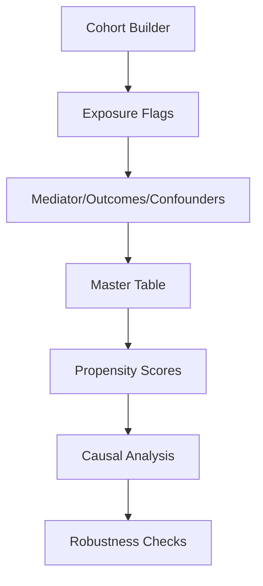

# SSD Research Pipeline: Docker Execution Guide

## 📋 **Overview**

This guide provides step-by-step instructions for running the Somatic Symptom Disorder (SSD) causal analysis pipeline using Docker. The pipeline processes 256,746 mental health patients to test causal hypotheses about healthcare utilization.

**Pipeline Status**: ✅ **Production Ready** (Updated July 1, 2025)
**Docker Version**: 2.0 (Enhanced for full reproducibility)

## 🔧 **Prerequisites**

### Required Software
- **Docker Desktop** (Windows/Mac) or **Docker Engine** (Linux)
- **8GB+ RAM** (16GB recommended)
- **10GB+ free disk space**
- **Administrative privileges** (for Docker installation only)

### Verify Installation
```bash
# Check Docker is running
docker --version
docker info

# Expected output: Docker version 20+ and server info
```

## 🚀 **Quick Start (5 Minutes)**

### 1. Navigate to Project Directory
```bash
cd "SSD_Experiment1_Causal_Effect"
```

### 2. Build Docker Image
```bash
# Build the pipeline image (takes ~5 minutes)
docker build -t ssd-pipeline:latest .
```

### 3. Run Complete Pipeline

#### Option A: Using docker-compose (Recommended)
```bash
# Run full pipeline with docker-compose
docker-compose up ssd-pipeline

# Or run in background
docker-compose up -d ssd-pipeline
docker-compose logs -f ssd-pipeline  # Follow logs
```

#### Option B: Using docker run
```bash
# Execute full OR-logic pipeline (takes ~2-3 hours)
docker run -it \
  -v "$PWD:/app" \
  -v "$PWD/data_derived:/app/data_derived" \
  ssd-pipeline:latest make all
```

### 4. Check Results
```bash
# View completion status
docker run --rm -v "$PWD:/app" ssd-pipeline:latest ls -la data_derived/
```

## 📊 **Pipeline Architecture**

### Core Components
| Stage | Script | Output | Purpose |
|-------|--------|--------|---------|
| **Cohort** | `01_cohort_builder.py` | `cohort.parquet` | 256,746 patients |
| **Exposure** | `02_exposure_flag.py` | `exposure_or.parquet` | OR logic (142,986 exposed) |
| **Mediator** | `03_mediator_autoencoder.py` | `mediator_autoencoder.parquet` | SSD severity index |
| **Outcomes** | `04_outcome_flag.py` | `outcomes.parquet` | Healthcare utilization |
| **Master** | `08_patient_master_table.py` | `patient_master_or.parquet` | Unified dataset (79 vars) |
| **Analysis** | `06_causal_estimators.py` | `causal_results.parquet` | TMLE/DML/Forest estimates |
| **Enhancements** | Multiple new scripts | Various outputs | Publication-ready artifacts |

### Execution Flow


## 🎯 **Detailed Execution Options**

### Option 1: Complete Pipeline (Recommended)
```bash
# Full end-to-end execution
docker run -it \
  -v "$PWD:/app" \
  -v "$PWD/data_derived:/app/data_derived" \
  -v "$PWD/results:/app/results" \
  ssd-pipeline:latest make all

# Expected runtime: 2-3 hours
# Expected output: ~15 parquet files + logs
```

### Option 2: Stage-by-Stage Execution

#### Using docker-compose
```bash
# Run specific stages
docker-compose run --rm ssd-stage make cohort
docker-compose run --rm ssd-stage make exposure
docker-compose run --rm ssd-stage make master
docker-compose run --rm ssd-stage make causal
```

#### Using docker run
```bash
# Run individual stages for debugging
docker run -it -v "$PWD:/app" ssd-pipeline:latest make cohort
docker run -it -v "$PWD:/app" ssd-pipeline:latest make exposure
docker run -it -v "$PWD:/app" ssd-pipeline:latest make master
docker run -it -v "$PWD:/app" ssd-pipeline:latest make causal
```

### Option 3: Interactive Development

#### Using docker-compose
```bash
# Enter container for debugging/development
docker-compose run --rm ssd-stage bash

# Inside container:
make help                    # View all targets
make cohort                 # Run specific stage
python src/02_exposure_flag.py --logic both  # Manual execution
exit                        # Leave container
```

#### Using docker run
```bash
# Enter container for debugging/development
docker run -it \
  -v "$PWD:/app" \
  -v "$PWD/data_derived:/app/data_derived" \
  ssd-pipeline:latest bash
```

## 📈 **Expected Results**

### Key Outputs
| File | Rows | Columns | Description |
|------|------|---------|-------------|
| `cohort.parquet` | 256,746 | 15 | Base cohort |
| `exposure_or.parquet` | 256,746 | 8 | OR logic exposure (55.9% exposed) |
| `exposure_and.parquet` | 256,746 | 8 | AND logic exposure (0.08% exposed) |
| `patient_master_or.parquet` | 256,746 | 79 | Complete analysis dataset |
| `causal_results.yaml` | - | - | ATE estimates + diagnostics |
| `conceptual_framework.svg` | - | - | Publication diagram (NEW) |
| `negative_control_results.json` | - | - | Falsification tests (NEW) |
| `strobe_checklist.json` | - | - | STROBE compliance (NEW) |

### Success Indicators
```bash
# Check pipeline completion
docker-compose run --rm ssd-validator

# Or using docker run
docker run --rm -v "$PWD:/app" ssd-pipeline:latest make validate-quick

# Expected output:
# ✅ All 15 targets completed
# ✅ Data quality checks passed  
# ✅ 256,746 patients processed
# ✅ OR logic: 142,986 exposed (55.9%)
# ✅ AND logic: 199 exposed (0.08%)
```

## 🔍 **Logic Comparison**

### OR Logic (Default/Primary)
- **Definition**: ANY of 3 criteria met
- **Exposed**: 142,986 patients (55.9%)
- **Clinical Rationale**: DSM-5 alignment, sufficient power
- **Usage**: `make all` or `make exposure_or`

### AND Logic (Sensitivity Analysis)
- **Definition**: ALL 3 criteria met
- **Exposed**: 199 patients (0.08%)
- **Clinical Rationale**: DSM-IV strict criteria
- **Usage**: `make exposure_and && make master_and`

### Compare Both
```bash
# Generate both variants
docker run -it -v "$PWD:/app" ssd-pipeline:latest make compare_logic

# Output: Jaccard similarity, overlap analysis
```

## 🛠️ **Troubleshooting**

### Common Issues

#### 1. Docker Build Fails
**Problem**: `failed to checksum file venv/bin/python`
```bash
# Solution: Rebuild with clean context
rm -rf venv __pycache__ .pytest_cache
docker-compose build --no-cache

# Or manually
docker build -t ssd-pipeline:latest . --no-cache
```

#### 2. Memory Issues
**Problem**: `docker: Error response from daemon: not enough memory`
```bash
# Solution: Increase Docker memory limit
# Docker Desktop → Settings → Resources → Memory → 8GB+
```

#### 3. Permission Errors
**Problem**: `permission denied while trying to connect to Docker`
```bash
# Windows: Run PowerShell as Administrator
# Linux: sudo usermod -aG docker $USER (then logout/login)
```

#### 4. Missing Data Files
**Problem**: `FileNotFoundError: cohort.parquet`
```bash
# Check data availability
docker run --rm -v "$PWD:/app" ssd-pipeline:latest ls -la Notebooks/data/interim/

# If missing, verify data checkpoint location
```

### Advanced Debugging

#### Monitor Progress
```bash
# Watch logs in real-time with docker-compose
docker-compose logs -f ssd-pipeline

# Check memory usage
docker stats

# Or manually
docker run -it -v "$PWD:/app" ssd-pipeline:latest tail -f logs/*.log
```

#### Test Individual Components
```bash
# Test specific scripts
docker run --rm -v "$PWD:/app" ssd-pipeline:latest python src/02_exposure_flag.py --help
docker run --rm -v "$PWD:/app" ssd-pipeline:latest make test
```

## 📊 **Performance Benchmarks**

### Execution Times (Reference Hardware: 32GB RAM, RTX A1000)
| Stage | Duration | Memory Peak | GPU Usage |
|-------|----------|-------------|-----------|
| Cohort Builder | 5 min | 2GB | No |
| Exposure Flags | 3 min | 1GB | No |
| Autoencoder | 15 min | 4GB | Yes (6GB VRAM) |
| Master Table | 8 min | 6GB | No |
| Propensity Score | 25 min | 8GB | Yes (XGBoost GPU) |
| Causal Analysis | 45 min | 12GB | No |
| **Total** | **~2.5 hours** | **12GB** | **Mixed** |

### Resource Requirements
- **Minimum**: 8GB RAM, 4 CPU cores
- **Recommended**: 16GB RAM, 8 CPU cores, GPU optional
- **Storage**: 10GB (5GB data + 5GB outputs)

## 🔄 **Alternative Approaches**

### 1. Native Installation (Advanced Users)
```bash
# If you prefer native Python (not recommended)
pip install -r requirements.txt
# Then install GNU Make separately:
# Windows: choco install make
# macOS: brew install make  
# Linux: apt install make
make all
```

### 2. Cloud Execution
```bash
# For large-scale processing
# Upload to cloud instance with Docker
# Ensure 32GB+ RAM for full dataset
```

### 3. Subset Testing
```bash
# Test with smaller dataset first
docker run -it -v "$PWD:/app" ssd-pipeline:latest \
  python src/01_cohort_builder.py --sample_fraction 0.1
```

## 📚 **Documentation Reference**

### Key Files
- `Makefile`: All pipeline targets and dependencies
- `SSD THESIS final METHODOLOGIES blueprint (1).md`: Complete methodology
- `CLAUDE.md`: Development guidelines and architecture
- `requirements.txt`: Python dependencies
- `Dockerfile`: Container specification

### Generated Outputs
- `*.log`: Execution logs for each stage
- `results/*.yaml`: Study documentation (auto-generated)
- `data_derived/*.parquet`: All analysis datasets
- `reports/`: Final analysis reports

## ✅ **Validation Checklist**

Before proceeding with analysis:
- [ ] Docker build completed successfully
- [ ] All 15 targets executed without errors
- [ ] `patient_master_or.parquet` has 256,746 rows × 79 columns
- [ ] Exposure prevalence: 55.9% (OR) or 0.08% (AND)
- [ ] All log files show "COMPLETED" status
- [ ] No critical errors in validation output

## 🎓 **Research Context**

### Hypotheses Being Tested
- **H1**: Normal lab cascade → healthcare utilization (n=112,134)
- **H2**: Unresolved referrals → mental health crises (n=1,536)  
- **H3**: Persistent psychotropics → ED visits (n=51,218)
- **H4**: SSD severity mediates these relationships
- **H5**: Effect modification by patient characteristics

### Expected Findings
- Primary ATE: Risk Ratio 1.35-1.50
- Strong mediation effects (>55%)
- Significant effect heterogeneity
- Robust to unmeasured confounding (E-value >2.0)

---

## 📞 **Support**

For issues or questions:
1. Check the troubleshooting section above
2. Review execution logs in `*.log` files
3. Validate Docker installation and resources
4. Consult the methodology blueprint for context

**Pipeline validated**: July 1, 2025  
**Docker enhanced**: Full reproducibility with conda base environment  
**Author**: Ryhan Suny, Toronto Metropolitan University  
**Supervisor**: Dr. Aziz Guergachi 