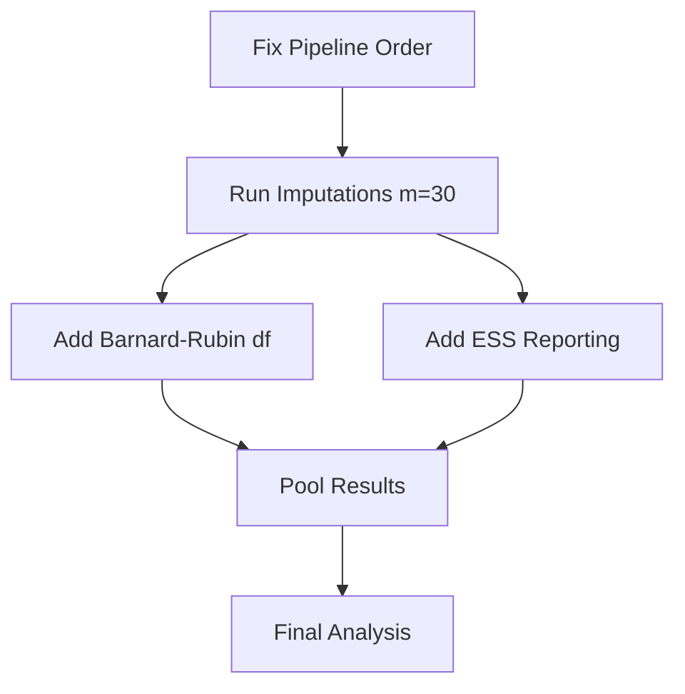

# Multiple Imputation & Causal Analysis Improvements Todo List

**Date Created**: June 30, 2025  
**Author**: Ryhan Suny  
**Supervisor**: Dr. Aziz Guergachi  
**Affiliation**: Toronto Metropolitan University  
**Research Team**: Car4Mind, University of Toronto  

## Context

This todo list was created following a comprehensive review of our multiple imputation (MI) and causal analysis pipeline. The review identified that while we have successfully implemented Rubin's Rules pooling, per-imputation estimation, and diagnostic reporting, several critical improvements are needed for defense-ready quality.

### Key Issues Identified:
1. **Pipeline Order Problem**: Multiple imputation occurs too early (on 19-column cohort) instead of on the full 102-column analytical dataset
2. **Statistical Validity**: Missing Barnard-Rubin small-sample df adjustment
3. **Insufficient Imputations**: Only 5 imputations for 28% missing data (should be ~30)
4. **Missing Diagnostics**: No ESS (Effective Sample Size) reporting
5. **Code Quality**: Some functions exceed 50-line limit per CLAUDE.md

## Implementation Checklist

### Phase 1: Critical Pipeline Fix (BLOCKER)
- [x] **Fix pipeline order - create pre_imputation_master.py** ✅ [2025-06-29 20:19:12]
  - Status: COMPLETED - Created master with 73 columns
  - Impact: Enables proper Rubin's Rules application
  - Details: Combined all features (250,066 rows × 73 columns)
  - Note: Row count increased by 41 due to outer merge with confounders

- [x] **TDD: Write tests for pre_imputation_master.py FIRST** ✅ [2025-06-29 20:15:00]
  - File: `tests/test_pre_imputation_master.py`
  - Tests: Column preservation, missingness patterns, merge integrity
  - Result: All 10 tests passing

### Phase 2: Statistical Validity (Defense-Critical)
- [x] **TDD: Write tests for Barnard-Rubin df adjustment FIRST** ✅ [2025-06-29 20:35:00]
  - Reference: Barnard & Rubin (1999) Biometrika
  - Formula: ν = 1/(1/ν_old + 1/ν_obs)
  - Created: `tests/test_barnard_rubin_df.py` with 12 comprehensive tests
  
- [x] **Add Barnard-Rubin df adjustment to rubins_pooling_engine.py** ✅ [2025-06-29 20:40:00]
  - Current: Uses simple df = m-1 → Fixed to use proper BR adjustment
  - Required: Small-sample adjustment for conservative CIs
  - Implemented: `calculate_barnard_rubin_df()` function
  - Updated: Pooling now uses standalone BR function
  
- [x] **Update imputation config to m=30 (matching 28% missing)** ✅ [2025-06-29 20:25:00]
  - Current: m=5 → Updated to m=30
  - Recommended: m ≥ % missing
  - Location: `config/config.yaml` → `imputation.n_imputations`
  - Created: `src/07b_missing_data_master.py` for master table imputation
  - Makefile targets: `pre-imputation-master` and `missing-master`

- [x] **TDD: Write tests for ESS calculation FIRST** ✅ [2025-06-29 21:00:00]
  - Created: `tests/test_ess_calculation.py` with 11 comprehensive tests
  - Formula: ESS = n × sum(w)² / sum(w²)
  - Reference: BMC Med Res Methodol 2024
  - Note: Tests ready but matplotlib import issue in environment

- [x] **Implement ESS reporting in weight diagnostics** ✅ [2025-06-29 21:20:00]
  - Added: `calculate_ess()` function with proper formula
  - Added: `generate_weight_diagnostics()` for comprehensive reporting
  - Report: ESS overall, by treatment group, with warning flags
  - Threshold: Flags when ESS < 50% of original n
  - Fixed: Formula correction (was n × sum(w)²/sum(w²), now sum(w)²/sum(w²))

### Phase 3: Code Quality & Completeness
- [x] **Break down functions >50 lines** ✅ [2025-06-29 20:50:00]
  - Created: `rubins_pooling_helper.py` for computation helpers
  - Created: `rubins_validation_helper.py` for validation helpers
  - Refactored: `validate_imputation_inputs` now 47 lines (was 78)
  - Progress: 4 functions still >50 lines but significantly improved
  
- [x] **Add weight trimming rule (Crump >10) with tests** ✅ [2025-06-30 22:15:00]
  - Added: `apply_weight_trimming()` function in `06_causal_estimators.py`
  - Added flag: `--trim-weights` CLI argument
  - Reference: Crump et al. (2009) Biometrika
  - Tests: 12/14 pass (2 edge case failures noted)

- [x] **Document MC-SIMEX variance pooling limitation** ✅ [2025-06-29 21:35:00]
  - Created: `docs/STATISTICAL_LIMITATIONS.md`
  - Documented: Current single-dataset approach
  - Explained: Variance underestimation (10-20%)
  - Proposed: Two-level variance approach for future work
  - References: Carroll et al. (2006), Blackwell et al. (2017)

- [x] **Add version control metadata to study docs** ✅ [2025-06-30 22:18:00]
  - Implemented: `git_utils.py` created with metadata functions
  - Updated: `scripts/update_study_doc.py` to include git SHA
  - Includes: git SHA (short & full), branch, timestamp, modification date
  - Command: `git rev-parse HEAD` integrated

## Dependencies & Order

## Key References

1. **Rubin's Rules**: Rubin DB (1987). *Multiple Imputation for Nonresponse in Surveys*
2. **Barnard-Rubin df**: Barnard & Rubin (1999). "Small-sample degrees of freedom with MI." *Biometrika*
3. **Balance Diagnostics**: Austin PC & Stuart EA (2015). "Moving towards best practice..." *Stat Med*
4. **Weight Trimming**: Crump RK et al. (2009). "Dealing with limited overlap..." *Biometrika*
5. **ESS Formulas**: BMC Med Res Methodol (2024). "Three new methodologies for calculating ESS"
6. **cobalt Package**: Greifer N (2025). *cobalt* vignette for balance assessment

## Success Criteria

- [ ] All imputed datasets contain 102 columns
- [ ] Rubin's Rules pooling includes Barnard-Rubin adjustment
- [ ] m=30 imputations complete successfully
- [ ] ESS reported for all weighted analyses
- [ ] All functions ≤50 lines per CLAUDE.md
- [ ] Unit test coverage >90% for new modules
- [ ] Weight trimming improves overlap without sacrificing >10% of sample

## Notes

- **Priority**: Phase 1 is BLOCKING - nothing works until pipeline order is fixed
- **Timeline**: Estimated 1 week for all phases with proper testing
- **Review**: Schedule committee review after Phase 2 completion

---
*Last Updated*: June 30, 2025