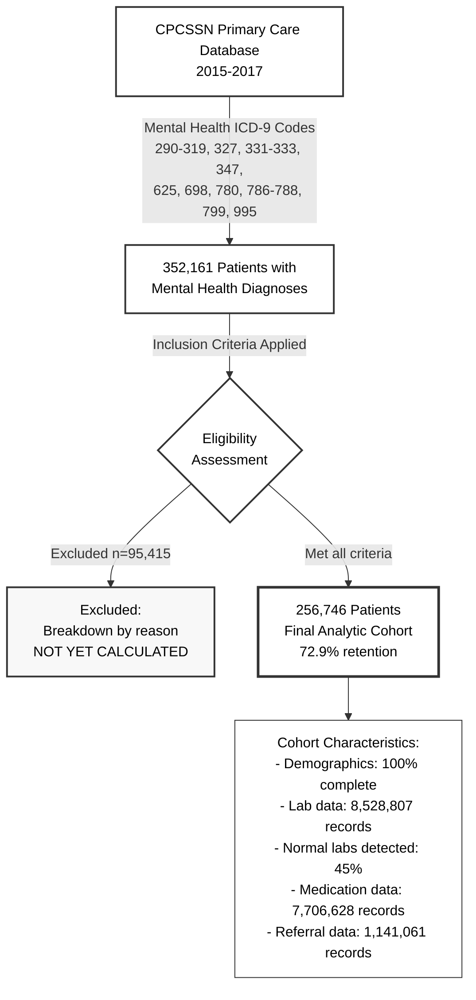

# STROBE Flow Diagram for SSD Causal Effect Study

## Figure 1: Participant Flow Diagram

## Data Notes

### Verified Numbers from Pipeline:
- **Initial cohort**: 352,161 patients (from SQL query with mental health ICD-9 codes)
- **Final cohort**: 256,746 patients (after cohort builder filters)
- **Excluded**: 95,415 patients (27.1% exclusion rate)
- **Retention**: 72.9%

### Inclusion Criteria Applied (from blueprint):
1. Age ≥ 18 years as of January 1, 2015
2. ≥ 30 consecutive months of EHR data before January 1, 2015
3. No palliative care codes (V66.7, Z51.5)
4. Charlson Comorbidity Index ≤ 5
5. Not opted out of CPCSSN

### Data Completeness (from checkpoint metadata):
- **Patient demographics**: 352,220 records
- **Encounters**: 11,577,739 records
- **Encounter diagnoses**: 12,471,764 records
- **Laboratory tests**: 8,528,807 records
- **Medications**: 7,706,628 records
- **Referrals**: 1,141,061 records

### Missing Data Summary:
- **Postal codes**: 0% available (critical for neighborhood deprivation)
- **Education**: 1.4% available
- **Occupation**: 7.6% available
- **Housing status**: 0.01% available

Note: Individual exclusion counts by criterion are NOT YET CALCULATED as the cohort builder script aggregates exclusions without itemizing by reason. 